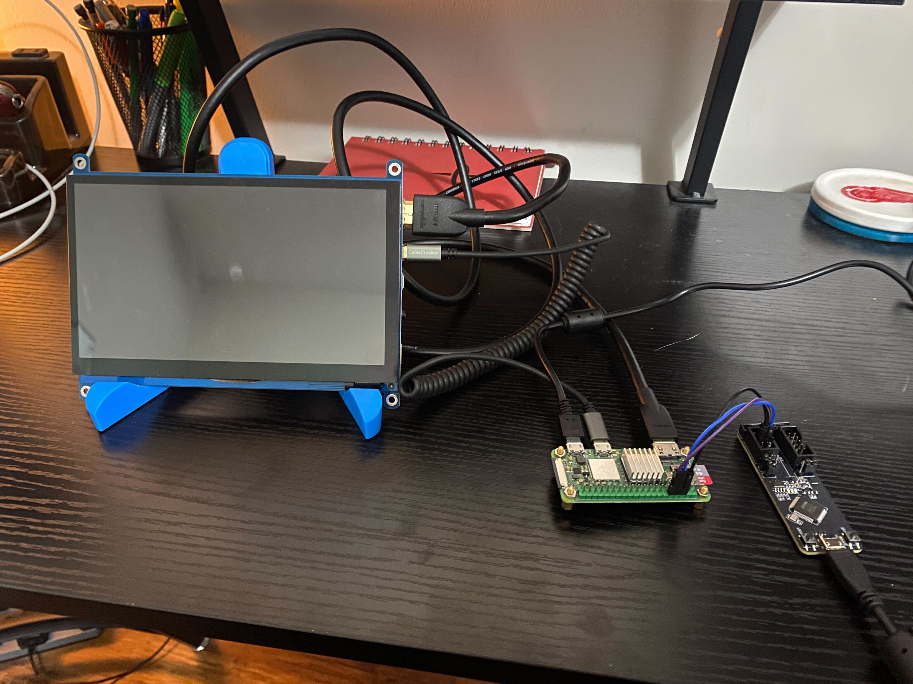

# devfest-pi-demo

This repository utilizes the [Yocto Project](https://www.yoctoproject.org/)'s [Poky](https://www.yoctoproject.org/software-item/poky/) reference distribution to build an embedded Linux OS capable of running [Flutter](https://flutter.dev/) in a few different ways.

## Prerequisites

>:warning: **Yocto Project tooling is required to run in a Linux environment.** If you are on Windows or an Intel-based Mac, you will need to setup a Linux environment. Please note that, although this is tooling in this repository to facilitate developing on Windows/MacOS, **full support is not guaranteed**.

See the [Dockerfile](.devcontainer/Dockerfile) for the full list of dependencies if you are on a Linux host.

If you are on a Windows 11 (or 10) host, see [windows_11_setup_steps.md](docs/windows_11_setup_steps.md) for instructions on setting up your environment.

## Getting Started

Clone this repository:

```bash
git clone --recursive git@github.com:lapumb-spindance/devfest-demo-pi.git
```

>Note: if you do not add the `--recursive` flag, run `./tools/update_submodules.sh` once the repository has successfully been cloned.

### Containerized Development

This repository utilizes Yocto Project tooling that is **required to be run in a Linux environment**. Since not everyone has access to a Linux machine, this repository has been containerized using [Visual Studio Code Remote Containers](https://code.visualstudio.com/docs/remote/containers). This allows you to develop in a Linux environment without having to install Linux on your machine.

If you choose to use a containerized environment for development, the following dependencies must be installed:

**MacOS**:

```bash
brew install node
npm install -g @devcontainers/cli
```

**Linux / WSL2**:

>Note: along with the following dependencies, if you are working in WSL(2) and have not already done so, it is probably a good idea to hike up your resources. For example, on a machine with 16GB RAM and 20 (logical) cores, you may want a configuration like the following in your `${env:USERPROFILE}\.wslconfig`:
>
  > ```txt
  >[wsl2]
  >memory=14GB
  >swap=4GB
  >processors=18
  >```
>
> See [the Microsoft documentation](https://learn.microsoft.com/en-us/windows/wsl/wsl-config#wslconfig) for more information about the `.wslconfig`.

```bash
sudo apt install nodejs npm -y
sudo npm cache clean -f
sudo npm install -g n
sudo n stable
sudo npm install -g @devcontainers/cli
```

:warning: If you opt to develop directly in WSL(2), be sure to install the dependencies outlined in the [Dockerfile](.devcontainer/Dockerfile).

[Docker Desktop](https://www.docker.com/products/docker-desktop) must also be installed and running. **Make sure you are signed into a docker account (free is fine) and docker is running**.

#### Visual Studio Code

>**Note: before proceeding, make sure you have the [Dev Containers Extension](https://marketplace.visualstudio.com/items?itemName=ms-vscode-remote.remote-containers) installed and enabled in Visual Studio Code.**

To utilize the container defined in this repository, open this repository in Visual Studio Code. You will likely be greeted with a prompt to "_Reopen in Container_". If so, click the "_Reopen in Container_" button, which will create a Docker container (if necessary) and mount you at the location of this repository in the container filesystem. If not, open the command palette (Mac: `Cmd+Shift+P`, Windows: `Ctrl+Shift+P`) and search for "Remote-Containers: Reopen in Container". A new VSCode window will open with the container running, where you can execute all your `git` commands and run the Yocto Project tooling.

#### Command Line

If you do not want to use VSCode, you can still use the containerized environment. From the root of this repository, run the following command, which will create a Docker container (if necessary) and mount you at the location of this repository in the container filesystem:

```bash
./.devcontainer/enter_container.sh
```

>To exit the container, enter the `exit` command.

#### Important Note about Containerized Development

It has been observed that errors occur when attempting to enter the container in VS Code after having already entered the container from the command line (and / or vice-versa). If you run into this issue, delete the image / container that was spun up by the other method and try again. **That said, it is probably best to stick to one method of entering the container until we figure out a more graceful solution**.

### Non-Containerized Development

Don't want to use a Docker container to build? No problem! See the [Yocto Project Quick Start](https://docs.yoctoproject.org/dev-manual/start.html#preparing-the-build-host) for setting up either your native Linux host.

### Project-Level Environment Setup

Once you have your Linux environment setup, it is time to setup the project environment by sourcing the `.envrc` file:

```bash
source .envrc
```

This can be done manually, or you can use [direnv](https://direnv.net/) (`sudo apt install direnv`) to automatically source this file when you enter the project directory.

>Note: if using `direnv`, ensure the tool is properly [hooked into your shell](https://direnv.net/docs/hook.html).

#### Custom Configurations

The `.envrc` file also sources a `.userenv` file if one is available. This file is ignored by git, so you can add any custom environment variables or overwrite any existing environment variables you see fit. For an example `.userenv` file, see the [example](.userenv.example) file.

### The `bitbake` Command

This repository is setup in a way that makes it simple for multiple developers to contribute to the same project. In order to achieve this, several custom environment variables have to be sent to `bitbake` to map dynamic paths correctly. Because of this, using the raw `bitbake` command **will not work**. Instead, utilize the `execute_bitbake.sh` script to properly source the environment variables and execute `bitbake`:

```bash
./execute_bitbake <additional_args_here>
```

>Note: this script is used within the [build.sh](build.sh). Do not use this script directly unless you are experienced with the Yocto Project tooling.

## Building and Flashing an Image

Once you have your environment setup and your hardware connected, it is time to build and flash the image to a uSD card. Building has been simplified to a `build.sh` script, which will build the `core-image-base` image by default. To build the image, simply run `./build.sh`.

Once the build completes successfully, you can flash the image to a uSD card by running `./flash.sh` **if you are working on a native Linux machine**. This script will automatically detect the newest image, but you also have the option to supply a specific image. Run `./flash.sh -h` for more information.

If you are _not_ on a native Linux machine, use the following for flashing:

- Windows: [rufus](https://rufus.ie/en/)
  >Keep the default options, but when "SELECT"ing a file, make sure to change the filter to `All files (*.*)`. When you plug in your uSD card, Windows will complain. Only focus on the `rufus` application and do not do anything with any explorer windows that pop up.
- MacOS: [balenaEtcher](https://etcher.balena.io/#download-etcher)

## Hardware Setup

1. [Raspberry Pi Zero 2W](https://www.raspberrypi.com/products/raspberry-pi-zero-2-w/)
1. [uUSB <--> uUSB cable](https://a.co/d/allFavy)
1. [uSD Card](https://a.co/d/2fGnNks)
1. [Waveshare 7" Capacitive Touch Display](https://www.waveshare.com/7inch-hdmi-lcd-h.htm)
1. [Header Pins](https://www.amazon.com/Jabinco-Breakable-Header-Connector-Arduino/dp/B0817JG3XN/ref=sr_1_4?keywords=header+pins&qid=1701398568&sr=8-4)

    >Note: you will have to solder these pins to the Raspberry Pi Zero 2W. If you are not comfortable with soldering, you can use a [Raspberry Pi Zero 2W with pre-soldered header pins](https://www.pishop.us/product/raspberry-pi-zero-2-w-with-pre-soldered-headers/), or a _different_ Raspberry Pi SBC. If you opt for the latter, you will need to update the `MACHINE` variable in the [local.conf](conf/local.conf) file to match your [Raspberry Pi SBC](https://github.com/agherzan/meta-raspberrypi/tree/kirkstone/conf/machine).

1. [ESP-Prog](https://docs.espressif.com/projects/espressif-esp-dev-kits/en/latest/other/esp-prog/user_guide.html)



## Running the Embedder Examples

The following sections outline the steps required to start and stop each embedder example. Please note that you must follow the "stop" steps for each example before starting another example.

### `wayland` Embedder

To run the Gallery application using the `wayland` embedder, run the following:

  ```bash
  # Start the Weston compositor
  systemctl start weston

  # Run the example
  systemctl start flutter-gallery

  # Note: if you want to monitor the service and Flutter logs:
  journalctl -fu flutter-gallery
  ```

To stop the example, run:

  ```bash
  systemctl stop weston
  systemctl stop flutter-gallery
  ```

### `DRM` Embedder

To run the Gallery application using the `DRM` embedder, run the following:

  ```bash
  flutter-drm-gbm-backend --bundle=/usr/share/flutter/gallery/3.13.9/release/

  # Optionally: append a " &" to the end of the command to run in the background so you can perform other tasks in the terminal
  ```

To stop the example, run:

  ```bash
  # Find your process ID
  ps aux | grep flutter-drm-gbm-backend

  # Kill the process
  kill <process_id>
  ```

### `flutter-pi` Embedder

To run the Gallery application using the `flutter-pi` embedder, run the following:

  ```bash
  flutter-pi --release /usr/share/flutter/gallery/3.13.9/release/

  # Optionally: append a " &" to the end of the command to run in the background so you can perform other tasks in the terminal
  ```

To stop the example, run:

  ```bash
  # Find your process ID
  ps aux | grep flutter-pi

  # Kill the process
  kill <process_id>
  ```

## Helpful Resources

- [Yocto Project Documentation](https://docs.yoctoproject.org/4.0.11/singleindex.html)
- [OpenEmbedded Layers Index](https://layers.openembedded.org/layerindex/branch/kirkstone/layers/)
- [DigiKey Yocto Project Introduction](https://www.youtube.com/playlist?list=PLEBQazB0HUyTpoJoZecRK6PpDG31Y7RPB)
  >The first video in the series is focused on [buildroot](https://buildroot.org/), but the rest of the videos are focused on the Yocto Project.
- [Helpful Embedded Flutter Plugins](https://github.com/sony/flutter-elinux-plugins#plugins)
- [Helpful Linux Flutter Packages](https://github.com/ardera/flutter-pi#-useful-dart-packages)
- [Debugging Embedded Flutter Applications](https://github.com/sony/flutter-embedded-linux/wiki/How-to-debug-Flutter-apps)
- [Debugging Flutter Embedders](https://github.com/sony/flutter-embedded-linux/wiki/Building-Embedded-Linux-embedding-for-Flutter#how-to-debug-the-embedder)
- [`libflutter_engine.so` Command Line Switches](https://github.com/flutter/engine/blob/main/shell/common/switches.h)